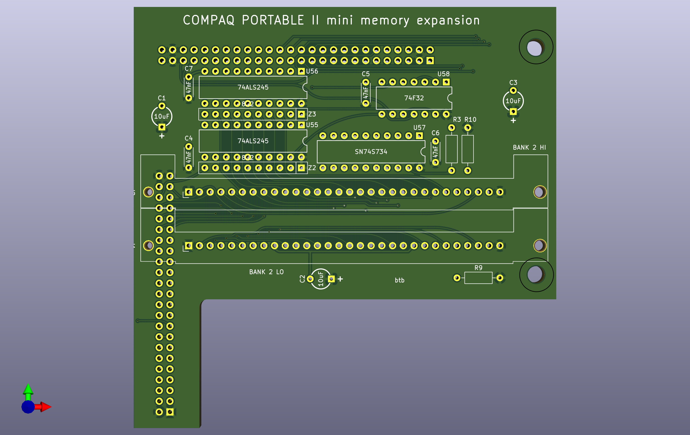

# Compaq Portable II Mini Memory Expansion

## TODO

More investigation of the possibility of using higher-density SIMMs.

SIMM socket just a smidge too close to the ICs. They'll hit if the ICs use sockets.

Placement of Bank3-4 expanson connector probably renders the nearby mounting hole useless.

Overlap of Bank3-4 expansion connector with SIMM socket not ideal.

SIMM could be turned around and hang over battery.

Can probably make a few mm bigger.

Would be nice if main connector was easier to align.

Find correct size standoffs.

## About

This is a 512K expansion board which connects directly to the motherboard of the Compaq Portable II.

Based on the reverse-engineered [System Memory Board](https://github.com/btb/PortableIIMemBoard).

